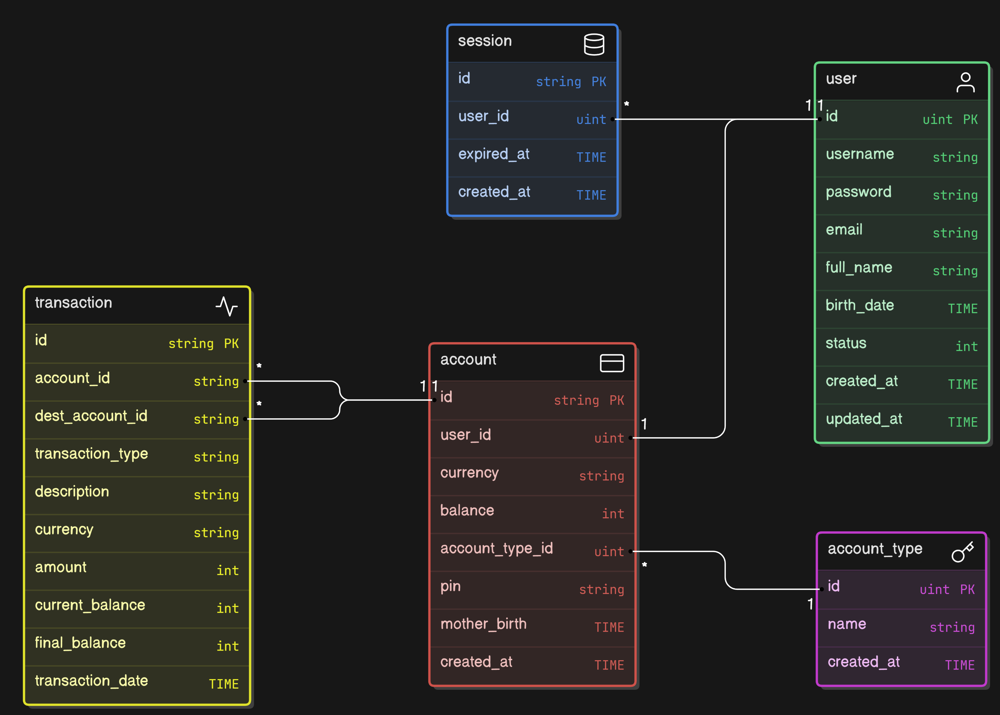

# Virtual Bank Arcitecture

---

## Architecture Database



## installation Project

1. Clone repository

2. Install backend package

   ```bash
   go get .
   ```

3. Copy file `.env.example` and rename to `.env`

4. Create database and name it `virtual_bank`

5. Run the following migration command

   ```bash
   go run cmd/migrate/main.go
   ```

6. Run the database value initialisation command as follows

   ```bash
   go run cmd/installer/main.go
   ```

   Next, follow the scarcity shown on the screen. make sure you run the command to initialise the account type value.

7. Install Web package

   ```bash
   cd Web
   npm i
   ```

   Wait for the process to finish

## Backend

### Run Development

Change the value of `GIN_MODE` in the `.env` file to `debug`

Default service run on port `3001`

```bash
go run cmd/api/main.go
```

### Run Production

Change the value of `GIN_MODE` in the `.env` file to `release`

Default service run on port `3001`

Run the backend service with the following command

```bash
go run cmd/api/main.go
```

### List All Command

```bash
go get .                     # install all package
go run cmd/migrate/main.go   # migate structure table
go run cmd/installer/main.go # initialise value in database
go run cmd/api/main.go       # run backend service
```

## Frontend

change directory to `wev`

### Run Develompemnt

Change the directory to ‘web’ with the following command

```bash
cd web
```

Run command

```bash
npm run dev
```

### Run Production

Run the build command

```bash
npm run build
```

Command to view build results

```bash
npm run preview
```

### List All Command

```bash
npm run dev     # run development
npm run build   # bundle project
npm run lint    # check writing all file
npm run preview # view the bundle result
```

## Framework & Library

- Gin Gonic (HTTP Framework) : https://github.com/gin-gonic/Gin
- GORM (ORM) : https://github.com/go-gorm/gorm
- Viper (Configuration) : https://github.com/spf13/viper
- Go Playground Validator (Validation) : https://github.com/go-playground/validator
- Vite JS (WEB Framework) : https://vite.dev/
- React JS (Liblary User Interface) : https://github.com/facebook/react
- React Router (Routing for React) : https://github.com/remix-run/react-router
- Axios (HTTP Client) : https://github.com/axios/axios
- Tailwindcss (CSS framework) : https://github.com/tailwindlabs/tailwindcss

## Configuration

All config in file `.env`

## Migrate

```bash
go run cmd/migrate/main.go
```

## Summary

### Run Init Value Database

```bash
go run cmd/installer/main.go
```

### Run Backend Service

```bash
go run cmd/api/main.go
```

### Run Frontend Development

```bash
npm run dev
```

### Run Frontend Build

```bash
npm run build
```

### Run Frontend Lint

```bash
npm run lint
```

### Run Frontend Preview

```bash
npm run lint
```
